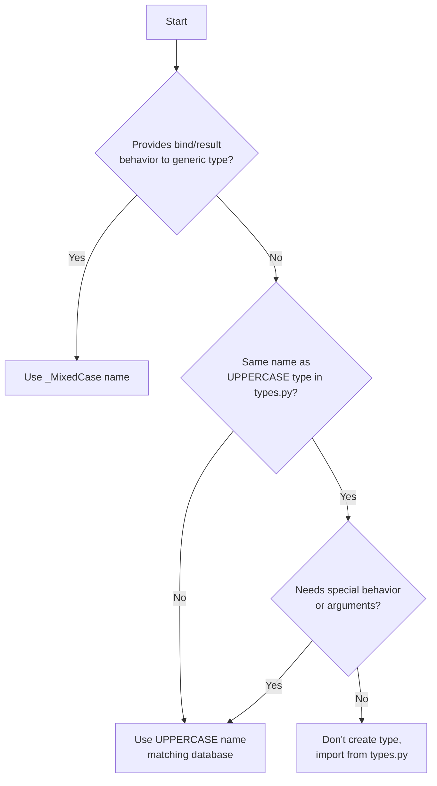

## Overview

These guidelines help dialect developers properly implement TypeEngine classes. Following these rules ensures consistency across dialects and proper integration with SQLAlchemy's type system.

<Note>
These guidelines are based on SQLAlchemy's internal type migration documentation and represent best practices for dialect development.
</Note>

## Purpose of TypeEngine Classes

TypeEngine classes in dialects serve three main purposes:

1. **Bind/Result Processing**: Custom behavior for binding parameters or processing result columns
2. **Database-Specific Types**: Types unique to the database with no generic equivalent
3. **Extended Generic Types**: Generic types with vendor-specific flags or options

<Warning>
If a TypeEngine class provides none of these, it should be removed from the dialect.
</Warning>

## Type Naming Conventions

Follow this decision tree for naming types:



### Private Types (_MixedCase)

Use for types that provide bind/result behavior to generic types:

```python
from sqlalchemy import types

class _SLDateTime(types.DateTime):
    """SQLite DateTime with custom processing."""
    
    def bind_processor(self, dialect):
        def process(value):
            if value is None:
                return None
            return value.strftime('%Y-%m-%d %H:%M:%S.%f')
        return process
    
    def result_processor(self, dialect, coltype):
        def process(value):
            if value is None:
                return None
            from datetime import datetime
            return datetime.strptime(value, '%Y-%m-%d %H:%M:%S.%f')
        return process
```

<Note>
Private types are invoked only via the `colspecs` dictionary and should not be imported by users.
</Note>

### Public Types (UPPERCASE)

Use for database-specific types or types with special arguments:

```python
from sqlalchemy import types

class INET(types.TypeEngine):
    """PostgreSQL INET type for IP addresses."""
    
    __visit_name__ = 'INET'

class ENUM(types.Enum):
    """MySQL ENUM type with database-specific options."""
    
    def __init__(self, *enums, **kw):
        self.strict = kw.pop('strict', True)
        super().__init__(*enums, **kw)
```

## Subclassing Rules

### When Type Name Matches types.py

If your type has the same name as a type in `sqlalchemy.types`:

```python
from sqlalchemy import types

# BLOB exists in types.py, so subclass it
class BLOB(types.BLOB):
    """Oracle BLOB type."""
    pass

# TIME exists in types.py
class TIME(types.TIME):
    """SQL Server TIME type with precision."""
    
    def __init__(self, precision=None, **kw):
        self.precision = precision
        super().__init__(**kw)
```

### When Type is Database-Specific

Subclass the closest generic type:

```python
from sqlalchemy import types

class SET(types.String):
    """MySQL SET type (no equivalent in types.py)."""
    
    def __init__(self, *values, **kw):
        self.values = values
        super().__init__(**kw)

class HSTORE(types.TypeEngine):
    """PostgreSQL HSTORE type."""
    
    __visit_name__ = 'HSTORE'
```

## Examples by Use Case

### Example 1: Private Type for Bind/Result Processing

```python
from sqlalchemy import types

class _SLDateTime(types.DateTime):
    """SQLite DateTime - adds processing for DateTime type."""
    
    # Registered in colspecs:
    # colspecs = {types.DateTime: _SLDateTime}
    pass
```

- **Name**: `_SLDateTime` (private, MixedCase)
- **Purpose**: Add bind/result processing to generic `DateTime`
- **Subclasses**: `types.DateTime`
- **User Access**: No, only via `colspecs`

### Example 2: Database Type with Special Arguments

```python
from sqlalchemy import types

class TIME(types.TIME):
    """MS-SQL TIME type with precision argument."""
    
    def __init__(self, precision=None, **kw):
        self.precision = precision
        super().__init__(**kw)
```

- **Name**: `TIME` (UPPERCASE, matches types.py)
- **Purpose**: Add `precision` argument for DDL
- **Subclasses**: `types.TIME`
- **User Access**: Yes, `from sqlalchemy.dialects.mssql import TIME`

### Example 3: Database Type with Bind/Result Processing

```python
from sqlalchemy import types

class _MSDate(types.Date):
    """MS-SQL internal Date type with special processing."""
    
    # Private - special bind/result behavior
    pass
```

- **Name**: `_MSDate` (private)
- **Purpose**: Bind/result processing only
- **Subclasses**: `types.Date`
- **User Access**: No

### Example 4: Unique Database Type

```python
from sqlalchemy import types

class SET(types.String):
    """MySQL SET type (no analogue in types.py)."""
    
    def __init__(self, *values, **kw):
        self.values = values
        super().__init__(**kw)
```

- **Name**: `SET` (UPPERCASE)
- **Purpose**: Database-specific type
- **Subclasses**: `types.String` (closest match)
- **User Access**: Yes

### Example 5: Import from types.py

```python
# In postgresql/base.py
from sqlalchemy.types import DATETIME

# Don't create a new class - PostgreSQL DATETIME
# works exactly like the generic one
```

- **Action**: Import, don't create
- **Reason**: No special behavior or arguments needed

## The colspecs Dictionary

`colspecs` maps generic types to dialect-specific implementations:

```python
from sqlalchemy import types as sqltypes

class MyDialect(DefaultDialect):
    colspecs = {
        # Map generic Boolean to dialect-specific implementation
        sqltypes.Boolean: _MyBoolean,
        
        # Map generic DateTime
        sqltypes.DateTime: _MyDateTime,
        
        # Only include types with special behavior
        sqltypes.String: _MyString,
    }
```

<Warning>
Only include types that have special bind/result processing. Don't add entries for types that work as-is.
</Warning>

## The ischema_names Dictionary

`ischema_names` maps database type names to SQLAlchemy types for reflection:

```python
class MyDialect(DefaultDialect):
    ischema_names = {
        # Map to generic types when possible
        'INTEGER': sqltypes.INTEGER,
        'VARCHAR': sqltypes.VARCHAR,
        'BOOLEAN': sqltypes.BOOLEAN,
        
        # Map to dialect types when needed
        'INET': INET,  # PostgreSQL-specific
        'ENUM': ENUM,  # MySQL-specific with args
        
        # Map database variants to same type
        'INT': sqltypes.INTEGER,
        'INT4': sqltypes.INTEGER,
    }
```

### Reflection Best Practices

1. **Prefer generic types**: Map to `sqlalchemy.types` UPPERCASE types when possible
2. **Use dialect types for special features**: Only use dialect-specific types when they have special arguments
3. **Handle variants**: Map all database type name variants

```python
ischema_names = {
    # Good - maps to generic type
    'TIMESTAMP': sqltypes.TIMESTAMP,
    
    # Good - dialect type with special collation argument
    'VARCHAR': VARCHAR,  # MyDialect's VARCHAR with collation
    
    # Avoid - don't map to private types
    # 'INTEGER': _MyInteger,  # Wrong!
    'INTEGER': sqltypes.INTEGER,  # Correct
}
```

## DDL Compilation

Type DDL is now handled by TypeCompiler, not TypeEngine:

```python
from sqlalchemy.sql import compiler

class MyTypeCompiler(compiler.GenericTypeCompiler):
    
    def visit_TIMESTAMP(self, type_, **kw):
        """Always renders as TIMESTAMP."""
        return "TIMESTAMP"
    
    def visit_VARCHAR(self, type_, **kw):
        """Add length and collation."""
        text = "VARCHAR"
        if type_.length:
            text += f"({type_.length})"
        if getattr(type_, 'collation', None):
            text += f" COLLATE {type_.collation}"
        return text
    
    def visit_BOOLEAN(self, type_, **kw):
        """Map to BIT for SQL Server."""
        return "BIT"
    
    def visit_large_binary(self, type_, **kw):
        """Map generic LargeBinary to VARBINARY(MAX)."""
        return "VARBINARY(MAX)"
```

### TypeCompiler Rules

1. **UPPERCASE methods**: Should render the exact type name
   ```python
   def visit_TIMESTAMP(self, type_, **kw):
       return "TIMESTAMP"  # Not "DATETIME" or something else
   ```

2. **lowercase methods**: Interpret generic types
   ```python
   def visit_boolean(self, type_, **kw):
       return self.visit_BIT(type_, **kw)  # Map to database type
   ```

3. **Never render strings directly**: Always call visit_UPPERCASE
   ```python
   # Wrong
   def visit_large_binary(self, type_, **kw):
       return "VARBINARY(MAX)"
   
   # Correct
   def visit_large_binary(self, type_, **kw):
       return self.visit_VARBINARY(type_, **kw)
   ```

## Complete Example

Here's a complete example for a fictional database:

<Tabs>
  <Tab title="Type Definitions">
    ```python
    from sqlalchemy import types

    # Private type - bind/result processing
    class _MyBoolean(types.Boolean):
        def bind_processor(self, dialect):
            def process(value):
                return 1 if value else 0
            return process
        
        def result_processor(self, dialect, coltype):
            def process(value):
                return bool(value)
            return process

    # Public type - database-specific with args
    class VARCHAR(types.VARCHAR):
        def __init__(self, length=None, collation=None, **kw):
            self.collation = collation
            super().__init__(length, **kw)

    # Public type - unique to database
    class INET(types.TypeEngine):
        __visit_name__ = 'INET'
    ```
  </Tab>
  <Tab title="Dialect Configuration">
    ```python
    from sqlalchemy.engine import default

    class MyDialect(default.DefaultDialect):
        name = 'mydialect'
        
        # Types with special behavior
        colspecs = {
            types.Boolean: _MyBoolean,
        }
        
        # Reflection mappings
        ischema_names = {
            'INTEGER': types.INTEGER,
            'VARCHAR': VARCHAR,  # Uses our VARCHAR for collation
            'BOOLEAN': types.BOOLEAN,
            'INET': INET,  # Database-specific
        }
    ```
  </Tab>
  <Tab title="Type Compiler">
    ```python
    class MyTypeCompiler(compiler.GenericTypeCompiler):
        
        def visit_VARCHAR(self, type_, **kw):
            text = "VARCHAR"
            if type_.length:
                text += f"({type_.length})"
            if type_.collation:
                text += f" COLLATE {type_.collation}"
            return text
        
        def visit_INET(self, type_, **kw):
            return "INET"
        
        def visit_boolean(self, type_, **kw):
            # Map generic boolean to database BOOLEAN
            return "BOOLEAN"
    ```
  </Tab>
</Tabs>

## Checklist

Before implementing a type:

- [ ] Does it provide bind/result processing? → Use `_MixedCase`
- [ ] Is it database-specific with no generic equivalent? → Use `UPPERCASE`
- [ ] Does it extend a generic type with special arguments? → Use `UPPERCASE`, subclass generic
- [ ] Does it work exactly like a generic type? → Import from `types.py`
- [ ] Added to `colspecs` if it has bind/result processing?
- [ ] Added to `ischema_names` for reflection?
- [ ] Implemented `visit_TYPENAME` in TypeCompiler?
- [ ] Subclasses appropriate base type?

## See Also

<CardGroup cols={2}>
  <Card title="Custom Dialects" href="/dialects/custom-dialects">
    Learn how to create custom dialects
  </Card>
  <Card title="Dialect Overview" href="/dialects/overview">
    Understanding the dialect system
  </Card>
</CardGroup>